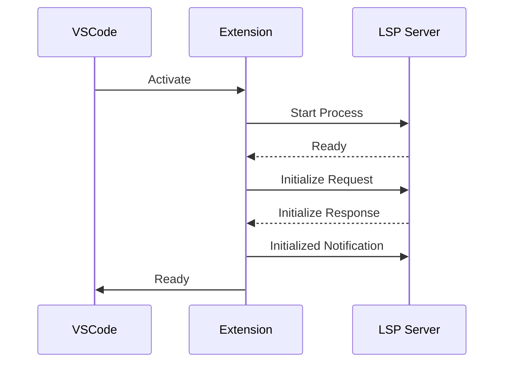
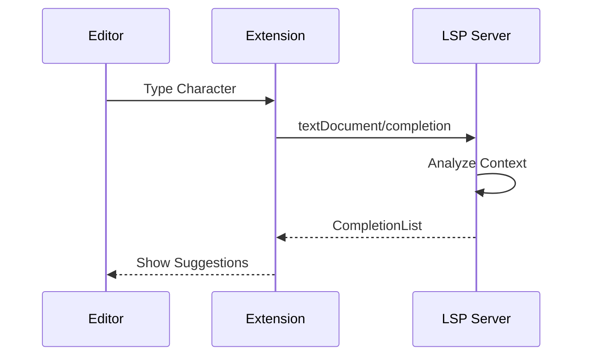

# Groovy LSP Extension API仕様

## 概要

Groovy LSP Extensionは、Language Server Protocol (LSP) を使用してGroovyとSpockの高度な開発支援を提供します。本ドキュメントでは、LSPサーバーとVSCode拡張機能のAPI仕様を定義しています。

## ドキュメント構成

### [LSPプロトコル仕様](./lsp-protocol.md)

Language Serverが実装するプロトコル仕様です：

- **標準LSP機能**: 補完、ホバー、定義ジャンプなど
- **Groovy拡張機能**: Groovy特有の型推論、動的メソッド対応
- **Spock専用機能**: データテーブル補完、ブロック構造認識
- **カスタムリクエスト**: クラスパス解決、AST情報取得
- **診断とエラーコード**: Groovy/Spock特有のエラー定義

### [VSCode拡張機能仕様](./vscode-extension.md)

VSCode拡張機能が提供する機能仕様です：

- **コマンド**: エディタコマンド、テスト実行、コード生成
- **設定項目**: SDK設定、エディタ設定、Spock設定
- **拡張API**: 他の拡張機能から利用可能なAPI
- **デバッグ機能**: Groovyスクリプトのデバッグ設定

## 主要機能

### 言語機能

| 機能 | 説明 | 対応状況 |
|------|------|----------|
| 構文ハイライト | Groovy/Spock構文の色付け | ✅ |
| 自動補完 | コード補完、インポート補完 | ✅ |
| 定義ジャンプ | シンボルの定義元へジャンプ | ✅ |
| 参照検索 | シンボルの使用箇所を検索 | ✅ |
| ホバー情報 | 型情報とドキュメント表示 | ✅ |
| シグネチャヘルプ | メソッド引数のヒント表示 | ✅ |
| リファクタリング | 名前変更、抽出、インライン化 | ✅ |
| コードフォーマット | コードの自動整形 | ✅ |
| 診断 | エラー・警告の表示 | ✅ |

### Spock特化機能

| 機能 | 説明 | 対応状況 |
|------|------|----------|
| ブロック認識 | given/when/then等の構造認識 | ✅ |
| データテーブル補完 | whereブロックでの補完支援 | ✅ |
| テストテンプレート | Spockテストの雛形生成 | ✅ |
| データ駆動テスト支援 | パラメータ化テストの作成支援 | ✅ |

## 通信プロトコル

### 初期化フロー



### リクエスト/レスポンス



## バージョニング

- **プロトコルバージョン**: セマンティックバージョニングに従う
- **後方互換性**: マイナーバージョンアップでは後方互換性を維持
- **非推奨機能**: 最低2バージョンは維持し、適切な警告を表示

## パフォーマンス指標

| 操作 | 目標応答時間 | 最大応答時間 |
|------|-------------|-------------|
| 補完 | < 100ms | 500ms |
| ホバー | < 50ms | 200ms |
| 定義ジャンプ | < 100ms | 300ms |
| 診断（ファイル） | < 200ms | 1000ms |
| フォーマット | < 500ms | 2000ms |

## トラブルシューティング

### よくある問題

1. **LSPサーバーが起動しない**
   - Groovy SDKパスを確認
   - JVMメモリ設定を確認
   - ログファイルを確認

2. **補完が遅い**
   - クラスパスのサイズを確認
   - インデックスの再構築を実行

3. **Spock機能が動作しない**
   - Spock依存関係を確認
   - `groovy.spock.enabled`設定を確認

### ログ出力

ログは以下の場所に出力されます：
- VSCode: Output Channel "Groovy Language Server"
- LSP Server: `~/.lsp-core/logs/`

## 開発者向け情報

### 拡張機能の利用

```typescript
// 拡張機能APIの取得
const groovyApi = vscode.extensions.getExtension('lsp-core-team.lsp-core')?.exports;

// APIの利用例
const projectInfo = await groovyApi.getProjectInfo(uri);
const testResults = await groovyApi.runTests({ uri });
```

### カスタム機能の追加

新しい機能を追加する場合：
1. LSPプロトコルを拡張（必要に応じて）
2. サーバー側実装を追加
3. クライアント側実装を追加
4. API仕様書を更新

## リファレンス

- [Language Server Protocol Specification](https://microsoft.github.io/language-server-protocol/)
- [VSCode Extension API](https://code.visualstudio.com/api)
- [Groovy Language Documentation](https://groovy-lang.org/documentation.html)
- [Spock Framework Documentation](https://spockframework.org/spock/docs/)