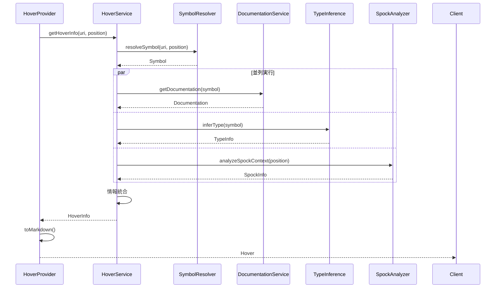

# ホバー機能実装設計

## 概要

ホバー機能は多くの情報源から情報を収集し、統合して表示する必要があります。このドキュメントでは、その実装アーキテクチャを定義します。

## アーキテクチャ概要

```
┌─────────────────┐
│  HoverProvider  │ ← LSP4Jインターフェース実装
└────────┬────────┘
         │
         ▼
┌─────────────────┐
│ HoverService    │ ← ビジネスロジックの中心
└────────┬────────┘
         │
         ├──────────────────────┬─────────────────────┬──────────────────┐
         ▼                      ▼                     ▼                  ▼
┌──────────────────┐  ┌───────────────────┐  ┌──────────────┐  ┌──────────────┐
│SymbolResolver    │  │DocumentationService│  │TypeInference │  │SpockAnalyzer │
└──────────────────┘  └───────────────────┘  └──────────────┘  └──────────────┘
```

## コンポーネント詳細

### 1. HoverProvider
- **責務**: LSP4Jのインターフェース実装
- **入力**: TextDocumentPositionParams
- **出力**: CompletableFuture<Hover>

### 2. HoverService
- **責務**: 各種情報源からの情報収集と統合
- **主要メソッド**:
  ```java
  Either<String, HoverInfo> getHoverInfo(
      String uri, 
      Position position
  )
  ```

### 3. 情報収集コンポーネント

#### 3.1 SymbolResolver
```java
public interface SymbolResolver {
    // カーソル位置のシンボルを解決
    Either<String, Symbol> resolveSymbol(String uri, Position position);
    
    // シンボルの定義位置を取得
    Either<String, Location> getDefinition(Symbol symbol);
    
    // シンボルの完全修飾名を取得
    String getFullyQualifiedName(Symbol symbol);
}
```

#### 3.2 DocumentationService
```java
public interface DocumentationService {
    // JavaDoc/GroovyDocを取得
    Option<Documentation> getDocumentation(Symbol symbol);
    
    // 外部ライブラリのドキュメントを取得
    Option<Documentation> getExternalDocumentation(String fqn);
    
    // ドキュメントをMarkdown形式に変換
    String formatDocumentation(Documentation doc);
}
```

#### 3.3 TypeInferenceService
```java
public interface TypeInferenceService {
    // 型情報を推論
    Either<String, TypeInfo> inferType(Symbol symbol);
    
    // ジェネリクス情報を解決
    TypeInfo resolveGenerics(TypeInfo type, Context context);
    
    // 型階層を取得
    List<TypeInfo> getTypeHierarchy(TypeInfo type);
}
```

#### 3.4 SpockAnalyzer
```java
public interface SpockAnalyzer {
    // Spockブロックを識別
    Option<SpockBlock> identifyBlock(Position position);
    
    // データテーブルの型を推論
    Map<String, TypeInfo> inferDataTableTypes(WhereBlock where);
    
    // モック情報を取得
    Option<MockInfo> getMockInfo(Symbol symbol);
}
```

## データモデル

### HoverInfo（統合情報）
```java
@Data
public class HoverInfo {
    private final SignatureInfo signature;
    private final Option<Documentation> documentation;
    private final List<AnnotationInfo> annotations;
    private final Option<TypeInfo> typeInfo;
    private final Option<LocationInfo> location;
    private final Map<String, Object> additionalInfo;
    
    // Markdown形式で表示用テキストを生成
    public String toMarkdown() {
        // 実装...
    }
}
```

### SignatureInfo
```java
@Data
public class SignatureInfo {
    private final ElementKind kind; // CLASS, METHOD, FIELD, etc.
    private final String name;
    private final List<String> modifiers;
    private final Option<String> returnType;
    private final List<ParameterInfo> parameters;
    private final List<String> typeParameters;
}
```

### Documentation
```java
@Data
public class Documentation {
    private final String summary;
    private final Option<String> description;
    private final List<ParamDoc> params;
    private final Option<String> returns;
    private final List<ThrowsDoc> exceptions;
    private final Map<String, String> tags; // @since, @author, etc.
}
```

## 情報収集フロー



## キャッシュ戦略

### 1. ドキュメントキャッシュ
```java
@Singleton
public class DocumentationCache {
    private final Cache<String, Documentation> cache = 
        Caffeine.newBuilder()
            .maximumSize(1000)
            .expireAfterWrite(30, TimeUnit.MINUTES)
            .build();
}
```

### 2. 型情報キャッシュ
```java
@Singleton
public class TypeInfoCache {
    private final Cache<String, TypeInfo> cache = 
        Caffeine.newBuilder()
            .maximumSize(500)
            .expireAfterWrite(5, TimeUnit.MINUTES)
            .build();
}
```

## エラーハンドリング

### 1. 部分的失敗の許容
```java
public HoverInfo collectHoverInfo(Symbol symbol) {
    HoverInfo.Builder builder = HoverInfo.builder();
    
    // 各情報源からの取得を試み、失敗しても続行
    getSignature(symbol).fold(
        error -> log.warn("Failed to get signature: {}", error),
        builder::signature
    );
    
    getDocumentation(symbol).fold(
        error -> log.debug("No documentation found"),
        builder::documentation
    );
    
    // ... 他の情報も同様に
    
    return builder.build();
}
```

### 2. フォールバック
```java
public String getDisplayText(Symbol symbol) {
    return getDocumentation(symbol)
        .map(Documentation::getSummary)
        .getOrElse(() -> generateDefaultDescription(symbol));
}
```

## パフォーマンス最適化

### 1. 遅延評価
```java
public class LazyHoverInfo {
    private final Supplier<Documentation> documentationSupplier;
    private final Supplier<List<String>> usageExamplesSupplier;
    
    // 必要になるまで計算しない
    public Documentation getDocumentation() {
        return documentationSupplier.get();
    }
}
```

### 2. 非同期処理
```java
public CompletableFuture<HoverInfo> getHoverInfoAsync(Symbol symbol) {
    CompletableFuture<Documentation> docFuture = 
        CompletableFuture.supplyAsync(() -> getDocumentation(symbol));
    
    CompletableFuture<TypeInfo> typeFuture = 
        CompletableFuture.supplyAsync(() -> inferType(symbol));
    
    return CompletableFuture.allOf(docFuture, typeFuture)
        .thenApply(v -> buildHoverInfo(
            docFuture.join(), 
            typeFuture.join()
        ));
}
```

## テスト戦略

### 1. 単体テスト
- 各コンポーネントの個別テスト
- モックを使用した統合テスト

### 2. 統合テスト
```java
@Test
void testCompleteHoverFlow() {
    // 実際のGroovyコードでテスト
    String code = """
        class User {
            String name
            /** ユーザーの年齢 */
            int age
        }
        """;
    
    HoverInfo info = hoverService.getHoverInfo(
        "test.groovy", 
        new Position(3, 16) // "age"の位置
    );
    
    assertThat(info.getDocumentation())
        .map(Documentation::getSummary)
        .contains("ユーザーの年齢");
}
```

### 3. E2Eテスト
- VSCode拡張機能からの実際のホバーリクエスト
- 様々なGroovy構文でのテスト

## 今後の課題

1. **インクリメンタル更新**: ファイル編集時の効率的な情報更新
2. **プラグイン機構**: 新しい情報源を簡単に追加できる仕組み
3. **国際化対応**: 多言語でのドキュメント表示
4. **AI統合**: 使用例の自動生成やコード説明の生成